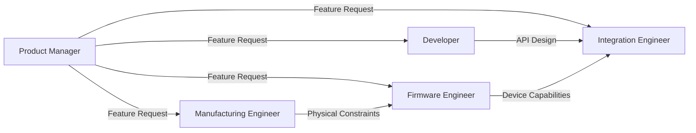

# Cross-Functional Collaboration Workflows
## OPAL Wearable Device Development

**Version:** 1.0
**Date:** 2025-11-12
**Purpose:** Define how Developer, Firmware Engineer, Manufacturing Engineer, and Integration Engineer work together

---

## Team Composition

| Role | Capability | Primary Responsibility |
|------|------------|------------------------|
| **Developer** | Execution | Backend APIs, business logic, cloud infrastructure |
| **Firmware Engineer** | Execution | Device firmware, hardware drivers, power optimization |
| **Manufacturing Engineer** | Manufacturing | Physical device design, production process, assembly |
| **Integration Engineer** | Execution | UI/UX, hospital system integration (EHR, Nurse Call) |

---

## Workflow 1: New Feature End-to-End

**Scenario:** Implement "Nurse-to-Patient Voice Alerts" feature

### Phase 1: Planning & Design



**Collaboration Flow:**

1. **Product Manager** presents feature: "Nurses need to send voice alerts to specific patient rooms"

2. **Integration Engineer** leads requirements gathering:
   - How will nurses trigger alerts? (mobile app button)
   - What info is shown? (patient name, room, alert status)
   - Which hospital systems integrate? (Overhead paging system)

3. **Developer** defines backend:
   - API: `POST /api/v1/alerts/voice`
   - Store alert audio in cloud storage (S3)
   - Queue for delivery to devices
   - Audit log for HIPAA compliance

4. **Firmware Engineer** assesses device capability:
   - Speaker can play alerts: ✅
   - Audio format: WAV, 16kHz, mono
   - Max file size: 500KB (memory constraint)
   - Power impact: ~100mA while playing (battery drain acceptable)

5. **Manufacturing Engineer** reviews physical design:
   - Current speaker (20mm, 8Ω, 1W): ✅ Sufficient volume
   - Speaker grille acoustic design: ✅ No changes needed
   - Assembly impact: None (no physical changes)

6. **Integration Engineer** drafts UI mockups:
   - Shows to nurses for feedback
   - Iterates based on usability testing

### Phase 2: API Contract Agreement

**Led by:** Developer + Integration Engineer

**Agreed API Contract:**
```yaml
POST /api/v1/alerts/voice
Request:
  nurseId: UUID
  patientId: UUID
  audioData: base64 (or upload URL)
  priority: "LOW" | "MEDIUM" | "HIGH"
  targetRoom: string

Response:
  alertId: UUID
  status: "QUEUED" | "SENT" | "DELIVERED" | "FAILED"
  estimatedDeliveryTime: ISO8601 timestamp
```

**Device Communication Protocol:**
```
Backend → Device (via MQTT or BLE)
Topic: device/{deviceId}/alerts
Payload: {
  alertId: UUID,
  audioUrl: string (HTTPS URL to download audio),
  priority: "HIGH",
  expiresAt: timestamp
}
```

### Phase 3: Parallel Implementation

**Developer:**
- Implements `/api/v1/alerts/voice` endpoint
- Sets up S3 bucket for audio storage
- Implements MQTT pub/sub for device communication
- Adds HIPAA audit logging

**Firmware Engineer:**
- Implements MQTT subscription on device
- Downloads audio file via HTTPS
- Plays audio through speaker
- Sends delivery acknowledgment
- Handles power management (wake from sleep to play alert)

**Integration Engineer:**
- Builds mobile app UI: "Record Voice Alert" screen
- Implements audio recording (iOS/Android native)
- Uploads audio to backend API
- Shows alert status to nurse

**Manufacturing Engineer:**
- No hardware changes required (monitors for issues)
- Updates factory test firmware to test speaker at higher volume

### Phase 4: Integration Testing

**Test Scenario 1: Happy Path**
1. Integration Engineer: Nurse records 10-second voice alert in app
2. Developer: Backend receives audio, stores in S3, publishes to MQTT
3. Firmware Engineer: Device receives message, downloads audio, plays through speaker
4. Integration Engineer: App shows "Alert delivered" status

**Test Scenario 2: Device Offline**
1. Firmware Engineer: Simulate device offline (Wi-Fi disconnected)
2. Developer: Alert queued in backend (retry logic)
3. Firmware Engineer: Device reconnects after 5 minutes
4. Developer: Backend delivers queued alert
5. Firmware Engineer: Device plays alert

**Test Scenario 3: Battery Low**
1. Firmware Engineer: Simulate 5% battery
2. Device receives alert but delays playback until plugged in
3. Firmware Engineer: Verifies power management works correctly

### Phase 5: Compliance Review

**Compliance Auditor:**
- Reviews audio storage: ✅ S3 bucket encrypted
- Reviews transmission: ✅ HTTPS for download, MQTT over TLS
- Reviews PHI handling: ✅ Audio may contain PHI, encrypted at rest/transit
- Reviews audit logging: ✅ All alert sends logged with nurse ID, patient ID, timestamp
- **Decision:** APPROVED for deployment

### Phase 6: User Acceptance Testing

**Integration Engineer** coordinates UAT with 5 nurses:
- Feedback: "Voice quality excellent"
- Feedback: "Sometimes delayed by 1-2 minutes"
- Developer investigates: MQTT message queuing issue, fixes
- Feedback: "Love this feature!"

**Result:** Feature approved for production

---

## Workflow 2: Hardware Design Change

**Scenario:** Upgrade device battery from 400mAh to 600mAh (longer battery life)

### Phase 1: Manufacturing Engineer Proposes Change

**Trigger:** Production data shows average battery life is 10 hours (target: >12 hours)

**Manufacturing Engineer:**
- Researches larger battery options
- Finds 600mAh cell with similar dimensions (slightly thicker)
- Calculates cost impact: +$0.50 per unit
- Proposes change to Product Manager

### Phase 2: Impact Assessment

**Manufacturing Engineer leads cross-functional review:**

**Questions for Firmware Engineer:**
1. Can firmware handle 600mAh battery? (voltage/charging)
   - **FW Answer:** Yes, same voltage (3.7V), charging circuitry supports up to 1000mAh
2. Any firmware changes needed?
   - **FW Answer:** Update battery capacity constant: `#define BATTERY_CAPACITY_MAH 600`
3. Expected battery life improvement?
   - **FW Answer:** From ~10 hours to ~15 hours (50% improvement)

**Questions for Developer:**
1. Any backend changes?
   - **Dev Answer:** None. Backend doesn't know about battery capacity.
2. Impact on device provisioning?
   - **Dev Answer:** None.

**Questions for Integration Engineer:**
1. Any UI changes?
   - **Int Answer:** Battery percentage calculation may be more accurate. No UI changes needed.
2. Impact on user docs?
   - **Int Answer:** Update spec sheet: "15+ hour battery life" (marketing improvement!)

**Manufacturing Engineer assesses physical changes:**
- New battery: 40mm x 30mm x 6mm (vs. 40mm x 30mm x 5mm)
- Device case impact: +1mm thickness
- Decision: Acceptable, redesign case slightly

### Phase 3: CAD Redesign

**Manufacturing Engineer:**
1. Updates CAD model of bottom case
2. Increases battery compartment depth by 1mm
3. Ensures all other components still fit
4. Sends updated CAD to mold shop for quote

**Mold Shop Quote:**
- Cost to modify existing mold: $3,000
- Lead time: 4 weeks

**Decision:** Approved (ROI: better product, minimal cost)

### Phase 4: Prototype & Test

**Manufacturing Engineer:**
- Orders prototype mold modification
- Receives T1 samples (first shots) in 4 weeks
- Assembles 10 prototype devices with new battery

**Firmware Engineer:**
- Updates firmware with new battery capacity
- Flashes prototypes
- Tests battery life: measures 14.5 hours (target achieved!)

**Integration Engineer:**
- Tests prototypes with nurses
- Feedback: "Device feels slightly heavier, but battery life is amazing!"

**Compliance Auditor:**
- Reviews battery certifications (UN38.3, UL)
- Verifies no safety issues
- Approves

### Phase 5: Production Transition

**Manufacturing Engineer:**
- Updates BOM: old battery → new battery
- Coordinates with supplier: order 1000 new batteries
- Trains assembly technicians on new battery installation
- Updates work instructions

**Firmware Engineer:**
- Releases firmware v1.1 with updated battery constant
- Manufacturing Engineer flashes all new devices with v1.1

**Timeline:**
- Week 1-4: Mold modification
- Week 5: Prototype assembly & testing
- Week 6: Compliance review & UAT
- Week 7: Production transition
- Week 8+: All new devices ship with 600mAh battery

---

## Workflow 3: Hospital System Integration

**Scenario:** Integrate with Epic EHR to sync patient assignments

### Phase 1: Requirements & Research

**Integration Engineer** leads:

1. **Research Epic FHIR APIs:**
   - Epic supports FHIR R4
   - Endpoint: `/Patient`, `/Practitioner`, `/Schedule`
   - Authentication: OAuth 2.0 (backend services)

2. **Define Requirements:**
   - Nurses see their assigned patients for current shift
   - Patient data: name, room, MRN, vitals
   - Update every 5 minutes
   - Work offline if Epic unavailable

3. **Consult Developer:**
   - "Can you create a backend proxy? Epic's API is complex."
   - Developer: "Yes, I'll create `/api/v1/nurses/{id}/patients` that calls Epic and simplifies response."

4. **Consult Compliance Auditor:**
   - "Epic integration will access PHI. Compliance requirements?"
   - Compliance: "OAuth tokens must be stored securely, all Epic API calls logged, Epic must sign BAA (Business Associate Agreement)."

### Phase 2: Epic OAuth Setup

**Developer:**
1. Registers OPAL as Epic client application
2. Receives `client_id` and `client_secret`
3. Implements OAuth 2.0 backend services flow:
   - Backend requests token from Epic
   - Token cached for 1 hour
   - Auto-refresh before expiration

**Security:**
- Client secret stored in AWS Secrets Manager (not in code)
- Tokens never exposed to frontend

### Phase 3: Backend Proxy Development

**Developer implements:**

```python
@app.get("/api/v1/nurses/{nurse_id}/patients")
async def get_nurse_patients(nurse_id: UUID, shift: str = "current"):
    # Get OAuth token
    epic_token = await get_epic_oauth_token()

    # Call Epic FHIR API
    epic_response = await epic_client.search({
        'resourceType': 'Patient',
        'practitioner': nurse_id,
        'date': current_shift_date(shift)
    }, headers={'Authorization': f'Bearer {epic_token}'})

    # Transform FHIR to simplified format
    patients = [
        {
            'id': patient.id,
            'name': patient.name[0].text,
            'room': patient.location.room,
            'mrn': patient.identifier.find(type='MRN').value,
            'status': patient.status
        }
        for patient in epic_response.entry
    ]

    # Audit log (HIPAA requirement)
    await audit_log({
        'nurse_id': nurse_id,
        'action': 'VIEW_PATIENT_LIST',
        'patient_count': len(patients),
        'source': 'EPIC_EHR'
    })

    return {'patients': patients}
```

### Phase 4: Frontend Implementation

**Integration Engineer implements:**

```typescript
// React Native mobile app

async function fetchPatients() {
  setLoading(true);
  try {
    const response = await apiClient.get(
      `/api/v1/nurses/${currentNurse.id}/patients`,
      { params: { shift: 'current' } }
    );

    setPatients(response.data.patients);

    // Cache for offline use
    await AsyncStorage.setItem(
      'cached_patients',
      JSON.stringify(response.data.patients)
    );
  } catch (error) {
    if (error.code === 'NETWORK_ERROR') {
      // Epic or backend unavailable - use cached data
      const cached = await AsyncStorage.getItem('cached_patients');
      if (cached) {
        setPatients(JSON.parse(cached));
        showWarning('Using cached patient list (Epic unavailable)');
      }
    }
  } finally {
    setLoading(false);
  }
}
```

### Phase 5: Compliance Review

**Compliance Auditor:**
- ✅ OAuth tokens stored securely (AWS Secrets Manager)
- ✅ No PHI in frontend localStorage (cached list uses patient IDs only)
- ✅ All Epic API calls logged
- ✅ Epic BAA signed
- ⚠️ **Issue:** Cached patient names in AsyncStorage (PHI)
  - **Remediation:** Integration Engineer removes names from cache, uses IDs only

**Re-review:**
- ✅ Cached data now PHI-free
- **Decision:** APPROVED

### Phase 6: Epic Sandbox Testing

**Integration Engineer + Developer:**
- Test against Epic sandbox environment
- Scenarios:
  1. Happy path: Nurse has 5 assigned patients ✅
  2. No patients: Nurse has no current assignments ✅
  3. Epic timeout: Backend retries, falls back to cache ✅
  4. OAuth token expired: Backend refreshes token automatically ✅

### Phase 7: Production Deployment

**Developer:**
- Deploys backend to production
- Configures Epic production credentials

**Integration Engineer:**
- Releases mobile app update
- Includes "Sync with Epic" feature

**Manufacturing Engineer:**
- Not involved (no hardware changes)

**Firmware Engineer:**
- Not involved (no device firmware changes)

**Result:** Nurses can now see their Epic patient assignments directly in OPAL app

---

## Workflow 4: Device Provisioning (Factory to Field)

**Scenario:** Manufacturing line produces 500 devices, how do they become nurse-ready?

### Phase 1: Manufacturing Assembly

**Manufacturing Engineer:**
1. Assembles device: case + PCB + battery + speaker + buttons
2. Device arrives at "Firmware Flashing" station

### Phase 2: Firmware Flashing

**Firmware Engineer provides:**
- Firmware binary: `opal_firmware_v1.2.bin`
- Flash script: `flash_device.sh`

**Manufacturing technician:**
```bash
# Connect device via JTAG
./flash_device.sh /dev/ttyUSB0 opal_firmware_v1.2.bin
```

**Result:** Device has firmware, but no identity (serial number, certificates)

### Phase 3: Device Provisioning

**Developer provides:**
- Provisioning script: `provision_device.py`
- Backend API: `POST /api/v1/devices` (registers device in cloud)

**Manufacturing technician:**
```bash
# Generate unique serial number
SERIAL=$(date +%Y%m%d)-$RANDOM

# Provision device
python provision_device.py --serial $SERIAL --port /dev/ttyUSB0

# This script:
# 1. Stores serial number in device NVS
# 2. Generates device certificate (crypto keys)
# 3. Calls backend API to register device
# 4. Backend returns configuration (Wi-Fi credentials, server URL)
# 5. Stores config in device NVS
```

**Result:** Device is now registered in cloud, has unique identity

### Phase 4: Factory Test (EOL)

**Firmware Engineer provides:**
- Factory test firmware: `factory_test_v1.0.bin`

**Manufacturing technician:**
- Temporarily flashes factory test firmware
- Device runs self-tests:
  - ✅ Speaker: plays test tone
  - ✅ Buttons: press each, LED confirms
  - ✅ Battery: reads voltage >3.7V
  - ✅ Wi-Fi: connects to test network
  - ✅ Cloud connectivity: pings backend API
- **Result:** Green LED = PASS, Red LED = FAIL
- If PASS: re-flash production firmware

**Manufacturing Engineer:**
- Logs test results in database
- Tracks yield: 98.5% first-pass (target: >98%) ✅

### Phase 5: Packaging

**Manufacturing Engineer:**
- Device placed in retail box
- Includes: USB cable, quick start guide, lanyard
- Box labeled with barcode (serial number)

### Phase 6: Hospital Deployment

**Integration Engineer:**
- Hospital receives 500 devices
- IT admin assigns devices to nurses in OPAL web dashboard
- Nurse receives device, opens app:
  1. App scans QR code on device (contains serial number)
  2. App calls backend: `PUT /api/v1/devices/{serial}/assign` with nurse ID
  3. Backend updates assignment
  4. Device is now linked to nurse

**Result:** Device is provisioned, tested, and field-deployed

---

## Communication Protocols

### Daily Standups (if used)

**Format:** Quick sync, <15 minutes

**Each role updates:**
- What I completed yesterday
- What I'm working on today
- Any blockers

**Example:**
- **Developer:** "Finished Epic integration API. Starting deployment today. No blockers."
- **Firmware Engineer:** "Working on power optimization. Need speaker spec from Manufacturing."
- **Manufacturing Engineer:** "Speaker spec: 8Ω, 1W, 20mm. Mold T1 samples delayed 1 week."
- **Integration Engineer:** "Finishing UI for Epic patient list. Testing with nurses tomorrow."

### Weekly Cross-Functional Sync

**Format:** 30-60 minutes, all roles

**Agenda:**
1. Feature status updates
2. Upcoming dependencies (who needs what from whom?)
3. Risks & impediments
4. Compliance/quality issues
5. Production updates (if applicable)

### Ad-Hoc Collaboration

**Tools:**
- Slack channels: `#dev-team`, `#firmware`, `#manufacturing`, `#integration`
- Video calls for complex discussions
- Shared docs (Confluence, Notion) for specs

**Best Practices:**
- Tag relevant people (@developer, @firmware-engineer)
- Use threads to keep conversations organized
- Document decisions in memory (Neo4j + ChromaDB)

---

## Decision Escalation

### When to Escalate to Human

**Scenarios:**
1. **Technical conflict:** Developer and Firmware Engineer disagree on device communication protocol
   - **Escalate to:** System Architect
2. **Cost overrun:** Manufacturing mold costs $30k instead of $15k
   - **Escalate to:** Product Manager
3. **Compliance blocker:** Compliance Auditor blocks deployment, team disagrees
   - **Escalate to:** Product Manager + Legal/Compliance team
4. **Scope creep:** Feature complexity growing, timeline at risk
   - **Escalate to:** Product Manager
5. **Component obsolescence:** Key battery discontinued, no drop-in replacement
   - **Escalate to:** Product Manager + Manufacturing Engineer

### Escalation Process

1. Document the issue (in Neo4j + ChromaDB)
2. State positions from each role
3. Present options with pros/cons
4. Recommend decision (agents should attempt consensus first)
5. Human makes final call
6. Document decision rationale for future reference

---

## Success Patterns

### Pattern 1: Early Collaboration
- ✅ Manufacturing Engineer involved in feature design (catches DFM issues early)
- ✅ Firmware Engineer and Developer agree on API before implementation
- ✅ Integration Engineer tests with nurses early (UX feedback before code complete)

### Pattern 2: Async Documentation
- ✅ All API contracts documented (OpenAPI specs)
- ✅ All decisions persisted to memory (Neo4j + ChromaDB)
- ✅ All design changes logged with rationale

### Pattern 3: Parallel Work
- ✅ Developer and Firmware Engineer work in parallel on agreed interface
- ✅ Integration Engineer mocks backend API while Developer builds real API
- ✅ Manufacturing Engineer orders components while firmware is in development

### Anti-Patterns to Avoid

- ❌ "Throw it over the wall": Developer finishes, then tells Firmware Engineer (no early collaboration)
- ❌ "Just make it work": Skipping compliance review to meet deadline
- ❌ "Not my problem": Manufacturing Engineer discovers DFM issue late, blames Designer
- ❌ "Surprise!": Major hardware change without notifying Firmware Engineer

---

## Metrics

### Cross-Functional Collaboration Health

| Metric | Target | How to Measure |
|--------|--------|----------------|
| Cross-capability collaboration events per sprint | >10 | Count meetings, Slack threads with multiple roles tagged |
| Escalations to humans | <3 per sprint | Count escalation events in memory |
| Rework due to late collaboration | <5% of story points | Track stories marked "rework needed" |
| Knowledge sharing (memory updates) | >20 per sprint | Count Neo4j updates from collaboration sessions |

---

**Remember:** The strongest products emerge from tight collaboration across disciplines. Software, firmware, hardware, and user experience must be designed together—not in silos.
